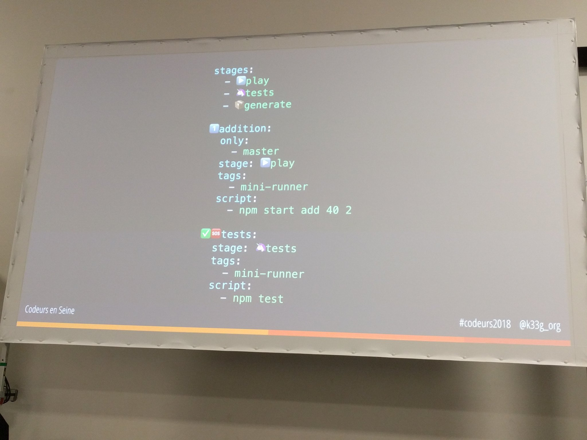

# Avec les GitLab Runners, comme Mickey dans Fantasia, devenez un apprenti sorcier de l'intégration continue (et du déploiement) 

## Cartouche d'identification

 - Manifestation : CodeursEnSeine 2018
 - Lieu : Kindarena Métropole Rouen Normandie
 - Conférence : Avec les GitLab Runners, comme Mickey dans Fantasia, devenez un apprenti sorcier de l'intégration continue (et du déploiement) 
 - Horaire de la conférence : 14h30
 - Durée de la conférence : 50 minutes
 - Conférencier(s) :
   - Philippe Charrière ([LinkedIn](https://www.linkedin.com/in/phcharriere/), [Github](https://github.com/k33g), [Twitter](https://twitter.com/k33g_org))
 - Audience : ...
 - Auteur du billet : Nicolas Douchin
 - Mots-clés : Gitlab, Gitlab CI, continuous integration & delivery, test automation
 - URL de l'illustration : 

## Support
 - Lien vers le support (diapos) présenté en conférence : indisponible
 - Nombre de diapos du support : N/A
 - Plan du support : 
   - Présentation de Gitlab et plus particulièrement de Gitlab CI
   - Présentation du système de templates pour créer des dépôts facilement.
   - Explication du fichier `.gitlab-ci.yml`.
   - Lancement des tests sur différentes branches.
   - Exemple de livraison grâce à l'outil de déploiement.

## Résumé
Gitlab est une plateforme permettant de gérer le cycle de vie de son produit de A à Z. ALlant du développement à la livraison en passant par les tests. Gitlab propose pour cela une fonctionnalité : Gitlab CI (Continuous Integration). Cet outil va pouvoir gérer les phases de tests, de build et de déploiement de notre application et ce la de manière automatisée. Tout est défini dans un fichier `.gitlab-ci.yml` qui définit les différents jobs et les contraintes et règles (par exemple, le job "deploiement" ne se déclenchera que sur la branche master) appliquées aux jobs. Afin d'exécuter ces jobs, il faut installer un runner sur une machine. Le runner va avoir pour rôle de poll régulièrement gitlab afin de vérifier si des modifications ont été apportées au code sur les différentes branches. Il exécutera ensuite les différents scripts définis par les jobs décrits dans le fichier `.gitlab-ci.yml`. L'enchainement de l'exécution des jobs est appelé "Pipeline". A chaque push, un pipeline sera créé. Il est possible de voir l'état de ceux-ci depuis l'interface WEB de gitlab qui va également afficher la console d'exécution du pipeline et ainsi permettra de voir où une erreur s'est produite. Il est également possible d'extraires des rapports/logs de ces pipelines en les plaçant dans des artefacts dont on peut définir une durée de vie.

## Architecture et facteur qualité
...
